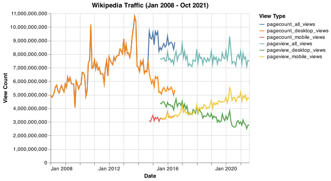

# data-512-a1

# Goal:
The goal of this assignment is to construct, analyze, and publish a dataset of monthly traffic on English Wikipedia from January 1 2008 through August 30 2021. 
For this assignment, we combine data about Wikipedia page traffic from two different Wikimedia REST API endpoints into a single dataset, perform some simple data processing steps on the data, and then analyze that data.


Folder Structure:
```
├── data_clean
    ├── en-wikipedia_traffic_200712-202109.csv
├── data_raw
    ├── pagecounts_desktop-site_200712-201608.json
    ├── pagecounts_mobile-site_200712-201608.json
    ├── pageviews_desktop_201507-202110.json
    ├── pageviews_mobile-app_201507-202110.json
    └── pageviews_mobile-web_201507-202110.json
├── results
        ├── wikipedia_traffic.png
└── hcds-a1-data-curation.ipynb
```


# Data Sources:
    Wikimedia Foundation REST API terms of use: https://www.mediawiki.org/wiki/REST_API#Terms_and_conditions
    

## API Documentation
1. [Pageview API](https://wikimedia.org/api/rest_v1/#/Pageviews%20data/get_metrics_pageviews_aggregate__project___access___agent___granularity___start___end_)
2. [Legacy (Pagecount) API](https://wikimedia.org/api/rest_v1/#/Legacy%20data/get_metrics_legacy_pagecounts_aggregate__project___access_site___granularity___start___end_)

# Output
| Column Name             | Description                                     |
|-------------------------|-------------------------------------------------|
| year                    | YYYY format |
| month                   | MM format|
| pagecount_all_views     | Number of page views from desktop + mobile (Pagecounts API) |
| pagecount_desktop_views | Number of page views from desktop (Pagecounts API) |
| pagecount_mobile_views  | Number of page views from mobile (Pagecounts API) |
| pageview_all_views      | Number of page views from desktop + mobile (Pageviews API) |
| pageview_desktop_views  | Number of page views from desktop (Pageviews API) |
| pageview_mobile_views   | Number of page views from mobile (Pageviews API)|
    
    

# Issues
1. The two different API's that we used have an overlap in 2015
2. The old API (pagecount) does not have a filter for removing web crawlers - the new API does. Since we are interested in organixe traffic, we filter out for it with the new API & so the older API 'overcounts' organic traffic
